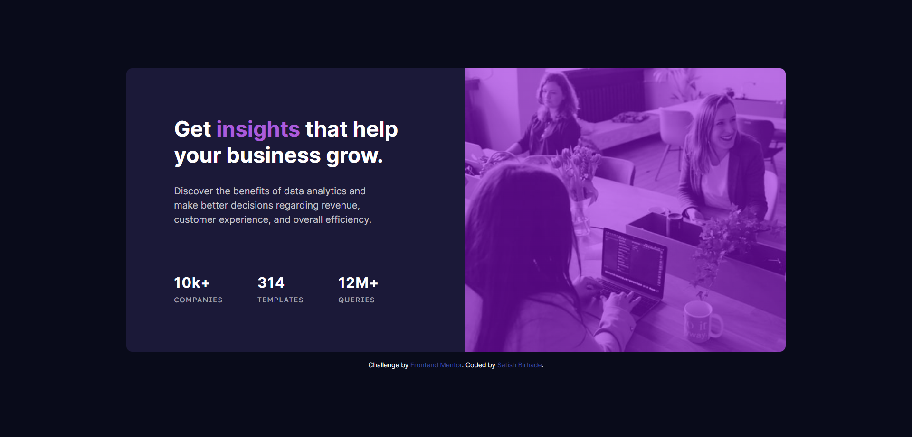
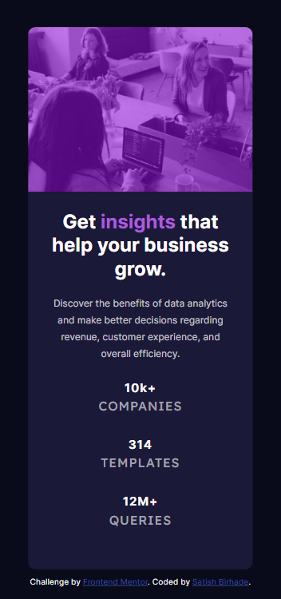

# Frontend Mentor - Stats preview card component solution

This is a solution to the [Stats preview card component challenge on Frontend Mentor](https://www.frontendmentor.io/challenges/stats-preview-card-component-8JqbgoU62). Frontend Mentor challenges help you improve your coding skills by building realistic projects. 

## Table of contents

- [Frontend Mentor - Stats preview card component solution](#frontend-mentor---stats-preview-card-component-solution)
  - [Table of contents](#table-of-contents)
  - [Overview](#overview)
    - [The challenge](#the-challenge)
    - [Screenshot](#screenshot)
      - [Desktop](#desktop)
      - [Mobile](#mobile)
    - [Links](#links)
  - [My process](#my-process)
    - [Built with](#built-with)
    - [What I learned](#what-i-learned)
    - [Useful resources](#useful-resources)
  - [Author](#author)

## Overview

### The challenge

Users should be able to:

- View the optimal layout depending on their device's screen size

### Screenshot

#### Desktop


#### Mobile



### Links

- Solution URL: [Add solution URL here](https://your-solution-url.com)
- Live Site URL: [Add live site URL here](https://your-live-site-url.com)

## My process

### Built with

- Semantic HTML5 markup
- CSS custom properties
- Flexbox
- CSS Grid
- Mobile-first workflow
- [Javascript](https://developer.mozilla.org/en-US/docs/Web/JavaScript) - Javascript

**Note: These are just examples. Delete this note and replace the list above with your own choices**

### What I learned

```html
<ul>
          <li>
            <h2>10k+</h2>
            <p>companies</p>
          </li>
          <li>
            <h2>314</h2>
            <p>templates</p>
          </li>
          <li>
            <h2>12M+</h2>
            <p>queries</p>
          </li>
        </ul>
```

```css
.proud-of-this-css {
  position: relative;
  min-height: 10rem;
  width: 540px;
  min-width: 200px;
  background:
    linear-gradient(var(--color-violet), var(--color-violet)),
    linear-gradient(var(--color-violet-light), var(--color-violet-light)),
    url('./images/image-header-desktop.jpg') no-repeat center center / cover;
  background-repeat: no-repeat;
  background-size: cover;
  border-radius: 0 10px 10px 0;
  overflow: hidden;
}
```

### Useful resources

- [HTML](https://www.w3schools.com/html/) - The resources on HTML provided by W3Schools were instrumental in helping me understand the structure and semantics of web pages. I particularly appreciated the clear explanations and practical examples, which I will continue to use in future projects.
- [CSS](https://www.w3schools.com/css/) - The comprehensive guide on CSS by W3Schools significantly enhanced my understanding of styling and layout. The detailed tutorials and examples made it easier to grasp complex concepts, and I highly recommend it to anyone looking to improve their CSS skills.
- [Javascript](https://www.w3schools.com/javascript/) - W3Schools' JavaScript tutorials were incredibly helpful in demystifying the fundamentals of scripting and dynamic content. The step-by-step approach and practical exercises were invaluable in building my confidence and competence in JavaScript.

## Author

- Frontend Mentor - [@SatishB15](https://www.frontendmentor.io/profile/SatishB15)
- Twitter - [@BirhadeSatish](https://x.com/BirhadeSatish)
- LinkedIn - [Satish Birhade](www.linkedin.com/in/satish-birhade)